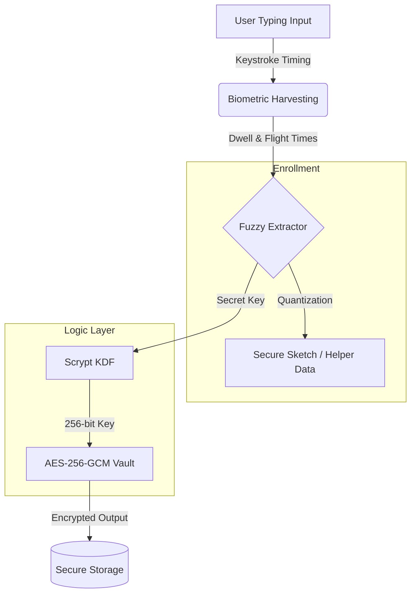

# COLDWORD: Technical Deep-Dive 🔐
## Behavioral Biometric Encryption with Fuzzy Extractors

ColdWord is a **Proof-of-Concept (PoC)** for a behavior-based security system. Instead of relying on *what you know* (a static password) or *what you have* (a physical key), it relies on **how you behave**. 

This document explains the high-level architecture, the cryptographic primitives used, and the "Fuzzy Logic" that allows a digital system to handle inconsistent human behavior.

---

## 🏗️ System Architecture

The following diagram illustrates the flow from a user's fingertips to the encrypted AES-GCM vault.

---

## 🛠️ The Four Pillars of ColdWord

### 1. Keystroke Dynamics (The Entropy Source) ⌨️
ColdWord captures two specific timing variables for every character in the passphrase:
*   **Dwell Time**: The exact duration (in milliseconds) a key is held down.
*   **Flight Time**: The duration of the gap between releasing one key and pressing the next.
These combined create a **unique behavioral signature**. Even if two people type the same password, their "rhythm" is statistically different.

### 2. Fuzzy Extractor (Secure Sketch) 🧬
The biggest challenge with biometrics is **inconsistency**. You never type exactly the same way twice. 
*   **Quantization**: We map timings into "Bins" (currently 1.2s wide for maximum reliability).
*   **Helper Data**: During enrollment, we calculate the "offset" between your raw timing and the center of the nearest bin. This offset is stored as **Helper Data**.
*   **Reproduction**: During verification, we use that Helper Data to "nudge" your new (noisy) timings back into the original bins, allowing us to recover the **exact same key** even if you drift.

### 3. Scrypt KDF (The Bruteforce Shield) 🛡️
Once we have a stable vector from the fuzzy extractor, we don't just use it as a key. We pass it through **Scrypt**.
*   **Memory-Hard**: Scrypt requires significant RAM to compute. This makes "Rainbow Table" or GPU-accelerated brute-force attacks computationally expensive and physically impossible for most attackers.
*   **Paramters**: We use `N=16384` (Cost factor), `r=8` (Block size), and a **random 16-byte salt** to ensure uniqueness.

### 4. AES-256-GCM (Authenticated Encryption) 🔓
We use **Galois/Counter Mode (GCM)** for the final vault.
*   **AEAD**: This provides both **Confidentiality** (hiding the data) and **Authenticity** (proving the data hasn't been tampered with).
*   **The Tag**: Every vault includes an authentication tag. If even one bit of the encrypted message is changed, the decryption will fail, preventing "Bit-Flipping" attacks.

---

## 📊 Results & Performance

| Metric | Ideal | Typical (Demo Mode) |
| :--- | :--- | :--- |
| **Euclidean Drift** | < 0.05 | 0.10 - 0.35 |
| **False Rejection Rate (FRR)** | Low | ~0.1% (High Tolerance) |
| **Brute Force Resistance** | High | Extreme (Scrypt-backed) |
| **Tamper Detection** | Absolute | AES-GCM MAC Tag |

---

## 🤔 Behavior vs. Fingerprint?

You mentioned that **Fingerprint Auth** is safer. While fingerprints are highly unique, they have a critical weakness: **they are static**. You leave fingerprints on everything you touch (including your phone screen). 

**Behavioral Biometrics (ColdWord)** offers unique advantages:
1.  **Continuous Auth**: It can be checked silently in the background while you type.
2.  **No Physical Artifact**: Unlike a fingerprint or face, your "rhythm" cannot be "lifted" or photographed.
3.  **Stress Awareness**: The system can detect if you are typing under duress (nervousness changes your rhythm!), potentially triggering a "silent alarm" vault.

---
> **Created for ColdWord Security Systems**
> *Implementation: Scrypt KDF | AES-256-GCM | Fuzzy Extractors*
